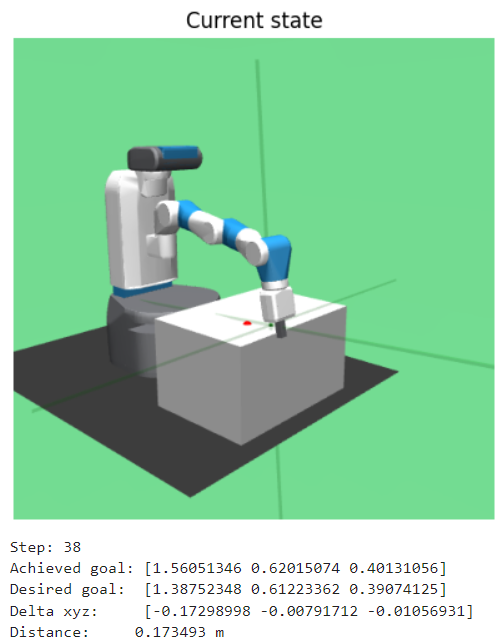
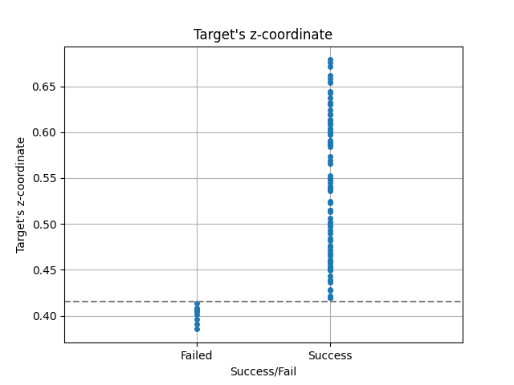

# Accurate and Robust Robot Reaching with Residual Reinforcement Learning

## Project Overview
Accurate and robust control remains challenging when observations are noisy, actions are imperfect, or the physical system does not respond exactly as commanded.
A physics-inspired controller can work well when the system is simple and well understood, but building an accurate dynamics model can be costly or impractical. 
This motivates the use of reinforcement learning (RL), even for seemingly simple robotic-control tasks.

This project studies a simulated reaching task using `FetchReachDense-v4` from Gymnasium-Robotics. In this environment, a simulated Fetch robot arm must move its end-effector to a target position. I first compare several policies in the nominal, noise-free environment, then evaluate their robustness under observation noise, action noise, and action scaling.

The implemented policies are:

- random rollout
- proportional controller
- Soft Actor-Critic (SAC)
- residual SAC built on top of the proportional controller

To make the task more challenging, I tightened the success criterion from the default 5 cm to 5 mm. This stricter threshold exposes fine-positioning errors that would be hidden under the default evaluation setting, but it also makes the analysis more sensitive to simulator geometry and target feasibility.

The central question is:

> Under this tightened condition, can a learned policy improve or complement a simple physics-inspired controller, and what failure modes emerge when fine-grained reaching accuracy is required?

## Key Takeaways

- A simple proportional controller is a strong baseline for the `FetchReachDense-v4` reaching task under a tightened 5 mm success threshold.
- The apparent 90% performance ceiling is not simply a controller or RL failure. Post-hoc error analysis suggests that the remaining failed cases correspond to targets near or below the table-top boundary, making them effectively infeasible under the strict success criterion.
- SAC learns a reaching strategy comparable to the proportional controller, but it does not overcome the infeasible target cases.
- Residual SAC, as implemented here, does not improve over the proportional controller, suggesting that residual learning is unlikely to help when the remaining errors are dominated by target feasibility rather than correctable control error.
- Observation noise has a strong impact when the noise magnitude is comparable to the strict 5 mm success threshold.
- Overall, the project highlights the importance of strong control baselines, failure-case analysis, and environment feasibility checks before interpreting RL performance limits.


## Installation

This project was developed with Python 3.12 and uses Gymnasium-Robotics, MuJoCo, Stable-Baselines3, NumPy, Pandas, and Matplotlib.

Clone the repository:

```bash
git clone https://github.com/yuanchimarkyang-lab/robot-reaching-residual-rl.git
cd robot-reaching-residual-rl
```

Create and activate a virtual environment:

```bash
python -m venv .venv
source .venv/bin/activate
```

Install dependencies:

```bash
pip install -r requirements.txt
```

The main environment used in this project is:

```text
FetchReachDense-v4
```

from Gymnasium-Robotics.

## Usage

First, verify that the MuJoCo/Gymnasium-Robotics environment works correctly:

```bash
python src/check_env.py
```

Run a random-policy rollout:

```bash
python src/random_rollout.py
```

Evaluate the proportional controller baseline:

```bash
python src/evaluate_baseline.py
```

Train the SAC policy:

```bash
python src/train_sac.py
```

Evaluate the trained SAC policy:

```bash
python src/evaluate_sac.py
```

Train the residual SAC policy:

```bash
python src/train_residual_sac.py
```

Evaluate the residual SAC policy:

```bash
python src/evaluate_residual_sac.py
```

Run robustness evaluations under observation noise, action noise, and action scaling:

```bash
python src/evaluate_robustness.py
```


The trained models are saved under `models/`, while evaluation metrics and plots are saved under `results/`.

## Repository Structure

```text
robot-reaching-residual-rl/
├── configs/
│   ├── env.yaml
│   ├── baseline.yaml
│   ├── sac.yaml
│   ├── residual_sac.yaml
│   └── robustness.yaml
│
├── src/
│   ├── check_env.py
│   ├── config.py
│   ├── controllers.py
│   ├── env_utils.py
│   ├── utils.py
│   ├── wrappers.py
│   ├── random_rollout.py
│   ├── evaluate_baseline.py
│   ├── train_sac.py
│   ├── evaluate_sac.py
│   ├── train_residual_sac.py
│   ├── evaluate_residual_sac.py
│   ├── evaluate_robustness.py
│
├── results/
│   ├── analysis/
│   ├── metrics/
│   └── plots/
│
├── models/
│   ├── sac/
│   └── residual_sac/
│
├── README.md
├── requirements.txt
└── .gitignore
```

### Directory Descriptions

| Directory / File   | Description                                                                                                       |
| ------------------ | ----------------------------------------------------------------------------------------------------------------- |
| `configs/`         | YAML configuration files for environment setup, controllers, RL training, residual RL, and robustness experiments |
| `src/`             | Source code for controllers, wrappers, training scripts, and evaluation scripts|
| `results/analysis/`| Jupyter notebook for analysis and plotting |
| `results/metrics/` | Evaluation results saved as CSV files |
| `results/plots/`   | Figures used in the README and analysis |
| `models/`          | Trained SAC and residual SAC models; usually excluded from Git tracking if model files are large|
| `README.md`        | Project description, methodology, results, discussion, and usage guide|
| `requirements.txt` | Python package dependencies |
| `.gitignore`       | Files and folders excluded from Git tracking |


## Method
### Summary of Policies
| Policy |	Description |
| :----- | :------------|
| Random | Samples actions uniformly from the action space. |
| Proportional controller | Moves the end-effector toward the target using the displacement between the current and desired goal positions. |
| SAC | Learns a continuous-control policy directly from interaction with the environment. |
| Residual SAC | Learns a correction term that is added to the proportional-controller action. |

### Random Controller
The random controller is used as a sanity check and lower-bound baseline:

```python
action = env.action_space.sample()
```

This verifies that the task cannot be solved reliably by chance alone.

### Proportional Controller
The proportional controller is a simple physics-inspired baseline. It commands the end-effector to move in the direction of the target:

```python
action[:3] = Kp * (desired_goal - achieved_goal)
action[3] = 0
```


Here, `Kp` controls the magnitude of the action. I have tested `Kp = 1,2,5,10,20`. Larger values of `Kp` might move the end-effector toward the target more quickly, but may produce less smooth action. Smaller values may move too slowly to reach the target within the fixed episode length. 

### SAC
I trained a Soft Actor-Critic (SAC) model using `stable_baselines3`.

SAC is an off-policy actor-critic algorithm for continuous control. It uses an actor network to propose actions and critic networks to estimate action values. Its objective includes an entropy term, which encourages exploration during training.

The SAC model was trained with 150,000 timesteps and evaluated every 5,000 steps. The best checkpoint was selected according to mean episode return on the evaluation environment.

### Residual SAC
The proportional controller provides a strong baseline but it is not perfect[^1]. Therefore, I tested whether SAC could learn a residual correction on top of the controller: 


<div style="background: #eeeff0; border:1px solid #a9aaac; border-radius:0px; padding:0px 16px; font-family:monospace; white-space:pre-wrap;">

$a_{\text{final}} = a_{\text{proportional}} + \alpha a_{\text{residual}}$</div>

where:

- $a_{\text{proportional}}$ is the action from the proportional controller
- $a_{\text{residual}}$ is the action proposed by SAC
- $\alpha$ controls how strongly the residual correction affects the final action

In this project, I used $\alpha = 0.3$ and trained the residual SAC model using the same training budget as the standard SAC model.

### Experiment Set-up
| Item | Note | 
| :--- | :---|
|number of evaluation episodes | 100 |
| length of each episode | 50 steps |
| success criterion | $\|d\| < 0.005\ \text{m}$, or 5 mm |
| reward | dense reward based on the negative distance between the achieved goal and desired goal  |
| episode return | sum of per-step rewards over the 50-step episode |


The success criterion is 10 times stricter than the default 0.05 m threshold. 
This stricter criterion was chosen to evaluate fine-grained reaching accuracy. 
However, this also makes the task more sensitive to small residual errors and may reduce learning efficiency near the target. 
It could also make the analysis more sensitive to simulator geometry and target feasibility.


 
## Results
### Without Perturbation
| Policy | Success Rate | Mean Episode Return | Final Distance (m) |
| :--- | :---: | :---: | :---: |
| Random | 0% | -9.54 $\pm$ 2.86 | 0.217 $\pm$ 0.098 |
| Proportional Controller |  90% | -0.277 $\pm$ 0.318 | 0.0018 $\pm$ 0.0056 |
| SAC | 89% | -0.332 $\pm$ 0.309 | 0.0031 $\pm$ 0.0052 |
| Residual SAC |  90% | -0.331 $\pm$ 0.298 | 0.0031 $\pm$ 0.0052 |

#### Random Rollout
The random rollout achieves a 0% success rate, with poor episode returns and large final distances. 
This confirms that the reaching task requires a meaningful control policy and cannot be solved reliably through random exploration.


#### Proportional Controller
The proportional controller provides a strong baseline, with mean final distance below the 5 mm success threshold. 
However, the 10% failure rate and the relatively large standard deviation in return and final distance suggests that some target configurations remain difficult for this simple controller. 

##### Kp ablation
| Kp | Success Rate | Mean Episode Return | Final Distance (m) |
| :--- | :---: | :---: | :---: |
| 1.0 | 0% | -3.389 $\pm$ 1.099 | 0.0268 $\pm$ 0.0087 |
| 2.0 |  47% | -1.975 $\pm$ 0.668 | 0.0054 $\pm$ 0.0057 |
| 5.0 |  90% | -0.798 $\pm$ 0.371 | 0.0025 $\pm$ 0.0057 |
| 10.0 |  90% | -0.399 $\pm$ 0.317 | 0.0021 $\pm$ 0.0057 |
| 20.0 |  90% | -0.277 $\pm$ 0.318 | 0.0018 $\pm$ 0.0056 |

Because `Kp` controls the action magnitude, `Kp = 1.0` and `Kp = 2.0` seem too small to reach the target reliably within 50 steps. The success rate saturates at `Kp = 5.0`, while the mean episode return continues to improve up to `Kp = 20.0`. This suggests that higher gains help in episodes where the controller can already make progress, but do not resolve the remaining hard cases. These hard cases likely dominate the remaining final-distance error and return variance.


##### Error Analysis
<center></center>

The error analysis for `Kp = 20.0` shows that the 10 failed episodes all involve residual displacement in the z-direction.
In these cases, the x/y displacement is reduced below the threshold early in the episode, often within fewer than 10 steps.
After that, the controller repeatedly applies actions in the z-direction, but the remaining z-error is not fully resolved.

This suggests that the proportional controller cannot handle some cases where the intended action does not translate into the expected end-effector displacement. 
This raises two following questions:

* Are these failures caused by mechanical or workspace limitations of the simulated Fetch arm? 
* Can a learned policy identify and correct these hard cases?

The post-hoc feasibility analysis below supports the first explanation.

##### Post-hoc Target Feasibility Analysis
This feasibility check was performed after the initial controller and RL experiments. I keep the original experiment flow in this README, but update the interpretation based on this follow-up analysis.

To understand why the failed cases occurred, I manually inspected the failed episodes in the simulator. In these cases, the targets appeared to be located near or below the effective table-top boundary. Under the tightened 5 mm success threshold, these targets are difficult or effectively infeasible for the end-effector to reach without moving outside the table region.

The figure below shows one manual-control trial. I attempted to move the end-effector below approximately `z = 0.4` m. The end-effector could only reach this region after moving outside the table area, suggesting that the table geometry limits reachable positions near this lower z-boundary.

<center></center>

To quantify this observation, I checked the target z-coordinate across all evaluation episodes. All failed cases had target z-coordinates below approximately 0.415 m, which is consistent with the effective table-top boundary in the rendered scene. 

<center></center>

This changes the interpretation of the 90% success ceiling. The remaining failures are likely not cases where SAC or residual SAC simply failed to learn a better correction. Instead, they appear to be effectively infeasible under the tightened 5 mm success threshold and the simulator geometry.

This also explains why increasing `Kp`, training SAC, and adding residual SAC all saturate near the same success rate: the limiting factor is not only policy quality, but also whether the sampled target can be physically reached within the environment constraints.

#### SAC
The SAC policy achieved performance close to the proportional controller, with similar success rate, mean episode return, and final distance.
This suggests that SAC might have learned a reaching strategy similar to the proportional controller. 

Initially, the saturation in success rate suggested that SAC may have learned the common easy cases while failing to resolve the rarer hard cases. However, the post-hoc feasibility analysis indicates that many of these hard cases correspond to target positions near or below the effective table-top boundary. Therefore, the similar 90% success rate of SAC is more likely caused by target feasibility limits than by insufficient learning alone.

#### Residual SAC
Residual SAC was designed to learn a correction that compensates for the proportional controller's failure modes.
In the current implementation, however, residual SAC did not improve over the proportional controller or standard SAC. 
Its performance was nearly identical to SAC and remained limited by the same hard cases.

The post-hoc feasibility analysis suggests that this ceiling is largely caused by target configurations that are effectively infeasible under the tightened 5 mm criterion. If the remaining failures are dominated by unreachable or geometrically constrained targets, then residual learning cannot be expected to solve them simply by improving the action policy.

This result is still informative: it shows that residual RL should be evaluated only after separating correctable control errors from environment or target-feasibility limitations.


### With Perturbation
I evaluated the policies under three perturbation settings:

1. observation noise
2. action noise
3. action scaling

Observation and action noise test sensitivity to imperfect sensing and control.
Action scaling tests whether the policy remains effective when the commanded action is weakened.

#### Observation Noise
<div style="background: #eeeff0; border:1px solid #a9aaac; border-radius:0px; padding:2px 16px; font-family:monospace;white-space:pre-wrap;line-height:1.0;">

$\tilde {s}_t = s_t + \epsilon_t$ </div>

where $\tilde {s}_t$ is the noisy observation, $s_t$ is the true observation (state), and $\epsilon_t$ is Gaussian noise.

<center></center>


When the observation noise becomes comparable to or larger than the 5 mm success threshold, the success rates of all policies drop sharply.
This indicates that fine-grained reaching accuracy requires sufficiently accurate observations.

In the regime where the observation noise is close to the success threshold, such as $\sigma = 0.005$ m or $\sigma = 0.01$ m, the proportional controller seems to be more robust than SAC and residual SAC. 
The learned policies seem to be more sensitive to small input perturbations, possibly because they were only trained in the nominal environment. 
In contrast, the simplicity of the proportional controller may make it less sensitive to small observation-level changes.   

#### Action Noise
<div style="background: #eeeff0; border:1px solid #a9aaac; border-radius:0px; padding:2px 16px; font-family:monospace;white-space:pre-wrap;line-height:1.0;">

$\tilde {a}_t = a_t + \epsilon_t$</div>

where $\tilde {a}_t$ is the noisy action, $a_t$ is the action proposed by the policy, and $\epsilon_t$ is Gaussian noise in action-command space.

<center></center>

Overall, the proportional controller, SAC, and residual SAC remain robust to moderate action noise. 
Their success rates degrade more clearly at higher noise levels, especially around $\sigma = 0.1$ in action-command units.

Interestingly, SAC achieves the highest success rate at $\sigma = 0.1$. 
This may indicate that the learned SAC policy is more tolerant to large command perturbations in this setting, potentially due to its probabilistic nature.
In contrast, the proportional controller and the residual SAC rely more heavily on the proportional-control action, which may make their behavior more sensitive when the action is strongly perturbed.  

#### Action Scale
<div style="background: #eeeff0; border:1px solid #a9aaac; border-radius:0px; padding:2px 16px; font-family:monospace;white-space:pre-wrap;line-height:1.0;">

$\bar {a}_t = f* a_t$</div>

where $\bar {a}_t$ is the scaled action, $a_t$ is the action proposed by the policy, and $f \in (0,1]$ is the scaling factor. 

<center></center>

Overall, the proportional controller, SAC, and residual SAC are robust to action scale. 
This suggests that, for this task, the direction of the action is more important than its magnitude. 
This is consistent with the `Kp` ablation where the proportional controller already achieved high success at `Kp = 5`.


## Discussion
The initial interpretation was that the remaining 10% failure cases might be due to controller limitations, insufficient RL training, or residual-learning design limitations. A more detailed post-hoc analysis suggests a different explanation: the failed cases are associated with target z-coordinates near or below the effective table-top boundary.

This finding changes the interpretation of the experiment. The proportional controller, SAC, and residual SAC all saturate near the same success rate, not necessarily because the learned policies fail to improve the controller, but because some sampled targets are effectively infeasible under the tightened 5 mm success criterion.

The main lesson is that RL performance should not be interpreted from success rate alone. When a policy fails, it is important to determine whether the failure is caused by insufficient learning, poor policy or reward design, noisy or imperfect control, or infeasible goals imposed by the environment.

In this project, the stricter success criterion was useful because it exposed fine-grained failure modes. However, it also revealed that some target samples may not be appropriate for evaluating policy improvement. 
A cleaner follow-up experiment would filter target positions by feasibility, or explicitly report performance separately on feasible and infeasible target subsets.

Potential next steps include:

1. designing a cleaner follow-up experiment that filters target positions by feasibility;
2. reporting performance separately for feasible and infeasible target subsets;
3. extending the same analysis framework to more complex manipulation tasks such as pushing or pick-and-place.


## Lessons Learned

The feasibility analysis was performed after the initial controller and RL experiments. In an ideal workflow, target feasibility would be checked earlier, before interpreting the 90% success ceiling as a policy-learning problem.

However, this kind of iteration is common in applied research. Initial experiments often reveal unexpected behavior, and deeper error analysis can change the interpretation of earlier results. In this case, the project evolved from a simple comparison of control and RL policies into a useful lesson about feasibility checks, simulator geometry, and careful failure-mode analysis.


The key lesson is that before using RL to improve a controller, one should first verify whether the observed failures are actually correctable by policy learning.
 


[^1]: The action in FetchReachDense-v4 is interpreted as a Cartesian control command rather than a direct state displacement. Therefore, the realized end-effector motion does not exactly equal the scaled action. This makes the proportional controller a useful but imperfect baseline, motivating residual learning as a way to correct the controller under the simulator dynamics.
