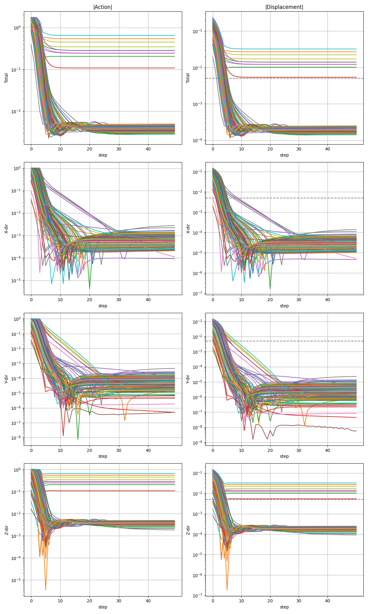
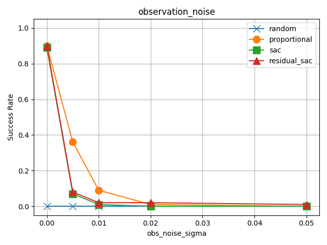
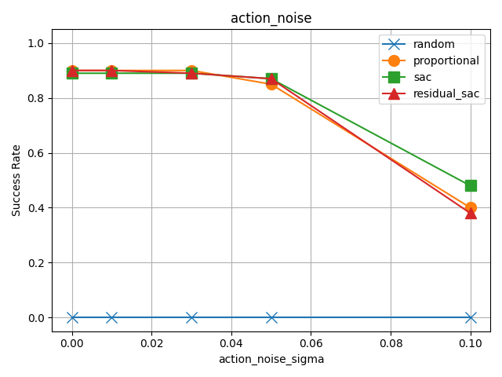
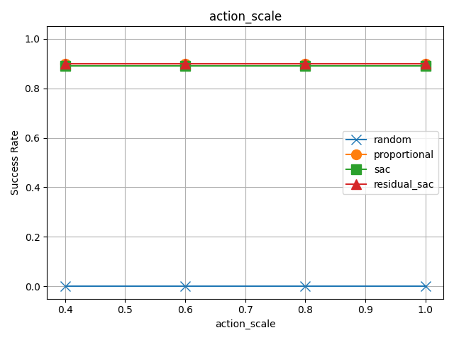

# Accurate and Robust Robot Reaching with Residual Reinforcement Learning

## Project Overview
Accurate and robust control remains challenging when observations are noisy, actions are imperfect, or the physical system does not respond exactly as commended.
A physics-inspired controled can work well when the system is simple and well understood, but building an accurate dynamics model can be costly or impractical. 
This motivates the use of reinforcement learning (RL), even for seemingly simple robotic-control tasks.

This project studies a simulated reaching task using `FetchReachDense-v4` from Gymnasium-Robotics. In this environment, a simulated Fetch robot arm must move its end-effector to a target position. I first compare several policies in the nominal, noise-free environment, then evaluate their robustness under observation noise, action noise, and action scaling.

The implemented policies are:

- random rollout
- proportional controller
- Soft Actor-Critic (SAC)
- residual SAC built on top of the proportional controller

The central question is:

> Can a learned policy improve or complement a simple physics-inspired controller, especially when control and observation are imperfect?

## Key Takeaways

- A simple proportional controller is a strong baseline for the `FetchReachDense-v4` reaching task.
- SAC can learn a comparable reaching strategy from environment interaction.
- The current residual SAC implementation does not yet improve over the proportional controller, likely because it does not specifically focus on the controller's failure modes.
- Observation noise has a strong impact when the noise magnitude is comparable to the strict 5 mm success threshold.
- The proportional controller is surprisingly robust in this simple task, highlighting the importance of comparing learned policies against meaningful control baselines.


## Installation

This project was developed with Python 3.12 and uses Gymnasium-Robotics, MuJoCo, Stable-Baselines3, NumPy, Pandas, and Matplotlib.

Clone the repository:

```bash
git clone https://github.com/yuanchimarkyang-lab/robot-reaching-residual-rl.git
cd robot-reaching-residual-rl
```

Create and activate a virtual environment:

```bash
python -m venv .venv
source .venv/bin/activate
```

Install dependencies:

```bash
pip install -r requirements.txt
```

The main environment used in this project is:

```text
FetchReachDense-v4
```

from Gymnasium-Robotics.

## Usage

First, verify that the MuJoCo/Gymnasium-Robotics environment works correctly:

```bash
python src/check_env.py
```

Run a random-policy rollout:

```bash
python src/random_rollout.py
```

Evaluate the proportional controller baseline:

```bash
python src/evaluate_baseline.py
```

Train the SAC policy:

```bash
python src/train_sac.py
```

Evaluate the trained SAC policy:

```bash
python src/evaluate_sac.py
```

Train the residual SAC policy:

```bash
python src/train_residual_sac.py
```

Evaluate the residual SAC policy:

```bash
python src/evaluate_residual_sac.py
```

Run robustness evaluations under observation noise, action noise, and action scaling:

```bash
python src/evaluate_robustness.py
```

<!--
Generate plots: 

```bash
python src/plot_day5.py
```
-->

The trained models are saved under `models/`, while evaluation metrics and plots are saved under `results/`.

## Repository Structure

```text
robot-reaching-residual-rl/
├── configs/
│   ├── env.yaml
│   ├── baseline.yaml
│   ├── sac.yaml
│   ├── residual_sac.yaml
│   └── robustness.yaml
│
├── src/
│   ├── check_env.py
│   ├── config.py
│   ├── controllers.py
│   ├── env_utils.py
│   ├── utils.py
│   ├── wrappers.py
│   ├── random_rollout.py
│   ├── evaluate_baseline.py
│   ├── train_sac.py
│   ├── evaluate_sac.py
│   ├── train_residual_sac.py
│   ├── evaluate_residual_sac.py
│   ├── evaluate_robustness.py
│
├── results/
│   ├── analysis/
│   ├── metrics/
│   └── plots/
│
├── models/
│   ├── sac/
│   └── residual_sac/
│
├── README.md
├── requirements.txt
└── .gitignore
```

### Directory Descriptions

| Directory / File   | Description                                                                                                       |
| ------------------ | ----------------------------------------------------------------------------------------------------------------- |
| `configs/`         | YAML configuration files for environment setup, controllers, RL training, residual RL, and robustness experiments |
| `src/`             | Source code for controllers, wrappers, training scripts, and evaluation scripts|
| `results/analysis/`| Jupyter notebook for analysis and plotting |
| `results/metrics/` | Evaluation results saved as CSV files |
| `results/plots/`   | Figures used in the README and analysis |
| `models/`          | Trained SAC and residual SAC models; usually excluded from Git tracking if model files are large|
| `README.md`        | Project description, methodology, results, discussion, and usage guide|
| `requirements.txt` | Python package dependencies |
| `.gitignore`       | Files and folders excluded from Git tracking |


## Method
### Summary of Policies
| Policy |	Description |
| :----- | :------------|
| Random | Samples actions uniformly from the action space. |
| Proportional controller | Moves the end-effector toward the target using the displacement between the current and desired goal positions. |
| SAC | Learns a continuous-control policy directly from interaction with the environment. |
| Residual SAC | Learns a correction term that is added to the proportional-controller action. |

### Random Controllerv
The random controller is used as a sanity check and lower-bound baseline:

```python
action = env.action_space.sample()
```
<!--
<div style="background: #eeeff0; border:1px solid #a9aaac; border-radius:0px; padding:0px 16px; font-family:monospace; white-space:pre-wrap;">

action = env.action_space.sample() </div>
-->

This verifies that the task cannot be solved reliably by chance alone.

### Proportional Controller
The proportional controller is a simple physics-inspired baseline. It commands the end-effector to move in the direction of the target:

```python
action[:3] = Kp * (desired_goal - achieved_goal)
action[3] = 0
```

<!--
<div style="background: #eeeff0; border:1px solid #a9aaac; border-radius:0px; padding:0px 16px; font-family:monospace; white-space:pre-wrap;">

action[:3] = action[:3] = Kp * (desired_goal - achieved_goal)
action[3] = 0</div>
-->

Here, `Kp` controls the magnitude of the action. I have tested `Kp = 1,2,5,10,20`. Larger values of `Kp` might mvoe the end-effector toward the target mode quickly, but may produce less smooth action. Smaller values may move too slowly to reach the target within the fixed episode length. 

### SAC
I trained a Soft Actor-Critic (SAC) model using `stable_baselines3`.

SAC is an off-policy actor-critic algorithm for continuous control. It uses an actor network to propose actions and critic networks to estimate action values. Its objective includes an entropy term, which encourages exploration during training.

The SAC model was trained with 150,000 timesteps and evaluated every 5,000 steps. The best checkpoint was is selected according to mean episode return on the evaluation environment.

### Residual SAC
The proportional controller provides a strong baseline but it is not perfect[^1]. Therefore, I tested whether SAC could learn a residual correction on top of the controller: 


<div style="background: #eeeff0; border:1px solid #a9aaac; border-radius:0px; padding:0px 16px; font-family:monospace; white-space:pre-wrap;">

$a_{\text{final}} = a_{\text{proportional}} + \alpha a_{\text{residual}}$</div>

where:

- $a_{\text{proportional}}$ is the action from the proportional controller
- $a_{\text{residual}}$ is the action proposed by SAC
- $\alpha$ controls how strongly the residual correction affects the final action

In this project, I used $\alpha = 0.3$ and trained the residual SAC model using the same training budget as the standard SAC model.

### Experiment Set-up
| Item | Note | 
| :--- | :---|
|number of evaluation episode | 100 |
| length of each episode | 50 steps |
| success critetia | $\|d\| < 0.005\ \text{m} = 5$, or 5 mm |
| reward | $-\sum_{i=1}^N r_i$, where the dense reward is based on distance to the target. The default $r_i = d_i^2$ |

where $ d = $ achieved\_goal $-$ desired\_goal

The success criteria is 10 times stricker than the default 0.05 m threshold. 
This stricker criteria was chosen to evaluate fine-grained reaching accuracy. 
However, this also makes the task more sensitive to small residual errors and may reduce learning efficiency near the target. 


 
## Results
### Without Perturbation
| Policy | Success Rate | Mean Episode Return | Final Distance (m) |
| :--- | :---: | :---: | :---: |
| Random | 0% | -9.54 $\pm$ 2.86 | 0.217 $\pm$ 0.098 |
| Proportional Controller |  90% | -0.277 $\pm$ 0.318 | 0.0018 $\pm$ 0.0056 |
| SAC | 89% | -0.332 $\pm$ 0.309 | 0.0031 $\pm$ 0.0052 |
| Residual SAC |  90% | -0.331 $\pm$ 0.298 | 0.0031 $\pm$ 0.0052 |

#### Random Rollout
The random rollout achieves a 0% success rate, with poor episode returns and large final distances. 
This confirms that the reaching task requies a meaningful control policy and cannot be solved reliably through random exploration.


#### Proportional Controller
The proportional controller provides a strong baseline, with mean final distance below the 5 mm success threshold. 
However, the 10% failure rate and the relatively large standard deviation in return and final distance suggests that some target configurations remain difficult for this simple controller. 

##### Kp ablation
| Kp | Success Rate | Mean Episode Return | Final Distance (m) |
| :--- | :---: | :---: | :---: |
| 1.0 | 0% | -3.389 $\pm$ 1.099 | 0.0268 $\pm$ 0.0087 |
| 2.0 |  47% | -1.975 $\pm$ 0.668 | 0.0054 $\pm$ 0.0057 |
| 5.0 |  90% | -0.798 $\pm$ 0.371 | 0.0025 $\pm$ 0.0057 |
| 10.0 |  90% | -0.399 $\pm$ 0.317 | 0.0021 $\pm$ 0.0057 |
| 20.0 |  90% | -0.277 $\pm$ 0.318 | 0.0018 $\pm$ 0.0056 |

Because `Kp` controls the action magnitude, `Kp = 1.0` and `Kp = 2.0` seems to be too small to reach the target reliuably within 50 steps. 
The success rate is saturated at `Kp = 5.0`, while the mean episode return continued to improve up to `Kp = 20.0`, 
This suggests that higher gains help in episodes where the controller can already make progress, but do not resolve the remaining hard cases.
These hard cases might likely be the limit to the mean episode return as well as the standard deviation.


##### Error Analysis
<center></center>

The error analysis for `Kp = 20.0` shows that the 10 failled episodes all involve residual displacement in the z-direction.
In these cases, the x/y displacement is reduced below the threshold early in the episode, often within fewer than 10 steps.
After that, the controller repeatedly apply actions in the z-direction, but the remaining z-error is not fully resolved.

This suggests that the proportional controller cannot handle some cases where the intended action does not translate into the expected end-effector displacement. 
This raises two following questions:

* Are these failures caused by mechanical or workspace limitations of the simulated Fetch arm? 
* Can a learned policy identify and correct these hard cases?

#### SAC
The SAC policy achieved performance close to the proportional controller, with similar sucess rate, mean episode return, and the final distance.
This suggests that SAC might have learned a reaching strategy similar to the proportional controller. 

However, the hard cases account for only about 10% of the evaluation set, indicating their scarcity in the training set. 
The SAC policy may therefore learn the majority of easy cases while still failing ro resolve the rarer hard cases, leading to a similar saturation at around 90% success.

#### Residual SAC
The Residual SAC was designed to learn a correction that compensates for the propotional controller's failure modes.
In the current implementation, hoever, residual SAC did not improve over the proportional controller or standard SAC. 
Its performance was nearly identical to SAC and remained limited by the same hard cases.

One likely explanation is that the residual policy learned behavior similar to the proportional controller instead of specializing in the controller's failure modes. This suggests that the current residual-learning design is not sufficient and should be revised.

A better next design may require targeted sampling of failure cases, a modified reward that emphasizes the final fine-positioning error, or a training scheme that explicitly encourages the residual policy to focus on controller correction rather than relearning the full reaching behavior.


### With Perturbation
I evaluated the policies under three perturbation settings:

1. observation noise
2. action noise
3. action scaling

Observation and action noise test sensitivity to imperfect sensing and control.
Action scaling tests whether the policy remains effective when the commanded action is weaken.

#### Observation Noise
<div style="background: #eeeff0; border:1px solid #a9aaac; border-radius:0px; padding:2px 16px; font-family:monospace;white-space:pre-wrap;line-height:1.0;">

$\tilde {s}_t = s_t + \epsilon_t$ </div>
where $\tilde {s}_t$ is the noisy observation, $s_t$ is the true observation (state), and $\epsilon_t$ is Gaussian noise.
<center></center>

<!--

-->

When the observation noise becomes comparable to or larger than the 5 mm success threshold, the success rates of all policies drop sharply.
This indicates that fine-grained reaching accuracy requires sufficiently accurate observations.

In the regime where the observation noise is close to the sucess threshold, such as $\sigma = 0.005$ m or $\sigma = 0.01$ m, the proportional controller seems to be more robust than SAC and residual SAC. 
The learned policies seem to be more sensitive to small input perturbations, possibly because they were only trained in the nominal environment. 
In contrast, the simplicity of proportional controller may make it less sensitive to small observation-level changes.   

#### Action Noise
<div style="background: #eeeff0; border:1px solid #a9aaac; border-radius:0px; padding:2px 16px; font-family:monospace;white-space:pre-wrap;line-height:1.0;">

$\tilde {a}_t = a_t + \epsilon_t$</div>
where $\tilde {a}_t$ is the noisy action, $a_t$ is the action proposed by the policy, and $\epsilon_t$ is Gaussian noise in action-command space.
<center></center>

Over all, the proportional controller, SAC, and residual SAC remain robust to moderate action noise. 
Their success rates degrade more clearly at higher noise levels, especially around $\sigma = 0.1$ in action-commend units

Interestingly, SAC achieves the highest success rate at $\sigma = 0.1$. 
This may indicate that the the learned SAC policy is more tolerant to large command perturbations in this setting, potentially due to its probablistic nature.
In contrast, the proportional controller and the residual SAC reply more heavily on the proportional-control action, which may make their behavior more sensitive when the action is strongly perturbed.  

#### Action Scale
<div style="background: #eeeff0; border:1px solid #a9aaac; border-radius:0px; padding:2px 16px; font-family:monospace;white-space:pre-wrap;line-height:1.0;">

$\bar {a}_t = f* a_t$</div>
where $\bar {a}_t$ is the scaled action, $a_t$ is the action proposed by the policy, and $f \in (0,1]$ is the scaling factor. 
<center></center>

Over all, the proportional controller, SAC, and residual SAC are robust to action scale. 
This suggests that, for this task, the direction of the action is more important than its magnitude. 
This is consistent with the `Kp` ablation where the  proportional controller already achieved high success at `Kp = 5`.


## Discussion
The remaining 10% failure cases may have several causes:
- **Mechanical or workspace limitation:** The target may be difficult or impossible for the simulated arm to reach from some configurations. This should be validated manually in the simulator.
- **Policy design limiation:** The learned policies may not receive enough informative samples from the hard cases. As a result, they learn the common easy cases but fail to resolve the rare failure modes. 
- **Residual-learning design limitation:** The current residual SAC design may still learn a general reaching strategy instead of specializing in the propotional controller's errors.

Potential next steps include:
1. manually validating the failed target configurations in the simulator
2. oversampling hard cases during training
3. designing a reward that emphasizes fine final-position accuracy
4. training the residual policy specifically on proportional-controller failure cases
5. adding domain randomization or noise-aware training.
6. extending the task to more complex manipulation settings such as pushing or pick-and-place.


[^1]: The action in FetchReachDense-v4 is interpreted as a Cartesian control command rather than a direct state displacement. Therefore, the realized end-effector motion does not exactly equal the scaled action. This makes the proportional controller a useful but imperfect baseline, motivating residual learning as a way to correct the controller under the simulator dynamics.
